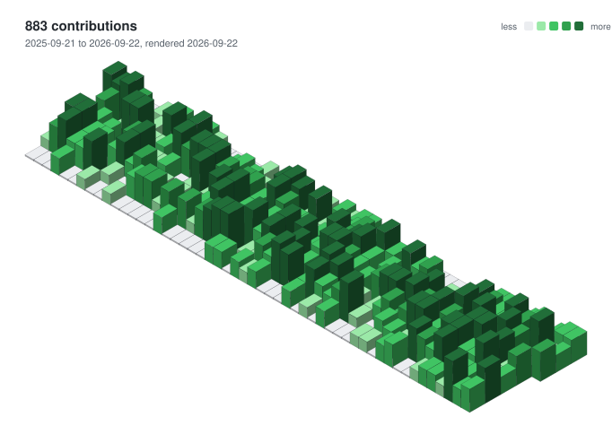
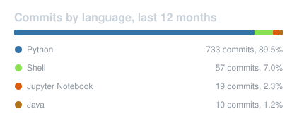
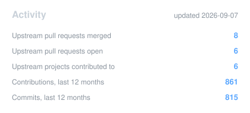

<h1 align="center">Hi, I'm Lee</h1>

  Inference systems and AI infrastructure. I work on the runtime side of multimodal model serving:
  attention dispatch, KV/weight transfer, LoRA and CUDA-graph lifecycles, and the measurements that prove a change is real.

  
  
  
  

## Contribution graph

<picture>
  <source media="(prefers-color-scheme: dark)" srcset="profile-3d-contrib/dark.svg">
  <source media="(prefers-color-scheme: light)" srcset="profile-3d-contrib/light.svg">
  
</picture>

## Upstream work

<!-- PRS:START -->
8 merged, 6 open, across `apache/bifromq`, `apache/otava`, `areal-project/AReaL`, `pytorch/helion`, `vllm-project/vllm-ascend`, `vllm-project/vllm-omni`

| Repository | Pull request | Status |
|---|---|---|
| vllm-project/vllm-omni | [#7094](https://github.com/vllm-project/vllm-omni/pull/7094) [Perf][Diffusion] Run MammothModa2 DiT attention through the shared attention layer | open |
| apache/otava | [#179](https://github.com/apache/otava/pull/179) Define the public API in otava/__init__.py | open |
| areal-project/AReaL | [#1676](https://github.com/areal-project/AReaL/pull/1676) perf(engine): encode each distinct image once per vision-tower forward | open |
| vllm-project/vllm-omni | [#6516](https://github.com/vllm-project/vllm-omni/pull/6516) [Model] Support SenseNova-U1.5-8B-MoT and its distilled 8-step LoRA | merged |
| pytorch/helion | [#3450](https://github.com/pytorch/helion/pull/3450) [compiler] Allow torch.matmul rank broadcasting; add sparse-attention indexer example | merged |
| vllm-project/vllm-omni | [#6317](https://github.com/vllm-project/vllm-omni/pull/6317) [Perf][Bugfix][OmniVoice] Restore float16 serving, and fuse the generator hot loop | merged |
| vllm-project/vllm-omni | [#6286](https://github.com/vllm-project/vllm-omni/pull/6286) [Model] Serve OpenVLA-7B as an autoregressive robot policy | open |
| apache/otava | [#169](https://github.com/apache/otava/pull/169) Make AnalyzedSeries change points lazy properties | merged |
| vllm-project/vllm-omni | [#6172](https://github.com/vllm-project/vllm-omni/pull/6172) [Bugfix] Stop reading the removed OmniRequestOutput.request_output accessor | merged |
| vllm-project/vllm-omni | [#6152](https://github.com/vllm-project/vllm-omni/pull/6152) [Bugfix] Carry ec_transfer_params and num_cache_creation_tokens on OmniRequestOutput | merged |
| vllm-project/vllm-omni | [#6111](https://github.com/vllm-project/vllm-omni/pull/6111) [Bugfix] Route text-only chat as per-request comprehension in HunyuanImage3 AR sampler | open |
| vllm-project/vllm-ascend | [#14110](https://github.com/vllm-project/vllm-ascend/pull/14110) [BugFix] Fix KeyError when remote_cached_tokens is missing in SFA PD RD2H producer | open |
| apache/bifromq | [#273](https://github.com/apache/bifromq/pull/273) Avoid reusing released APIServer response buffers | merged |
| apache/otava | [#166](https://github.com/apache/otava/pull/166) Make CSV importer configurable via ConfigArgParse | merged |

<!-- PRS:END -->

## Stack

  
  
  
  
  
  
  
  
  
  

## Activity

  
  

  

